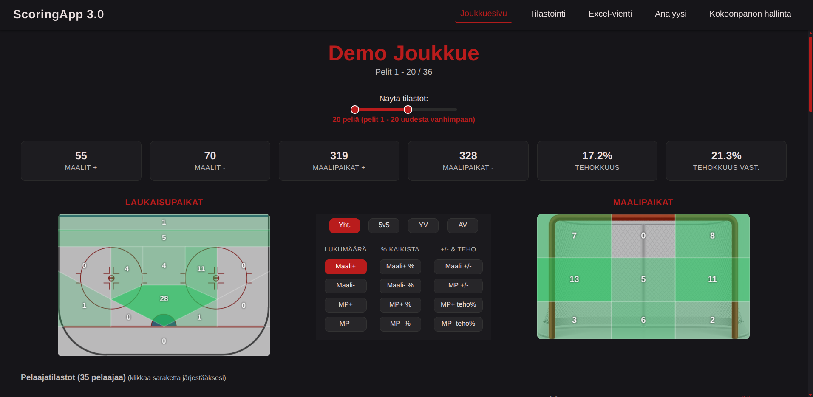
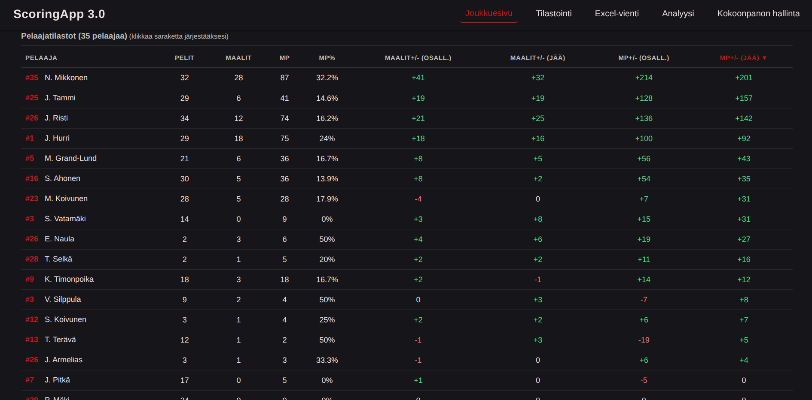
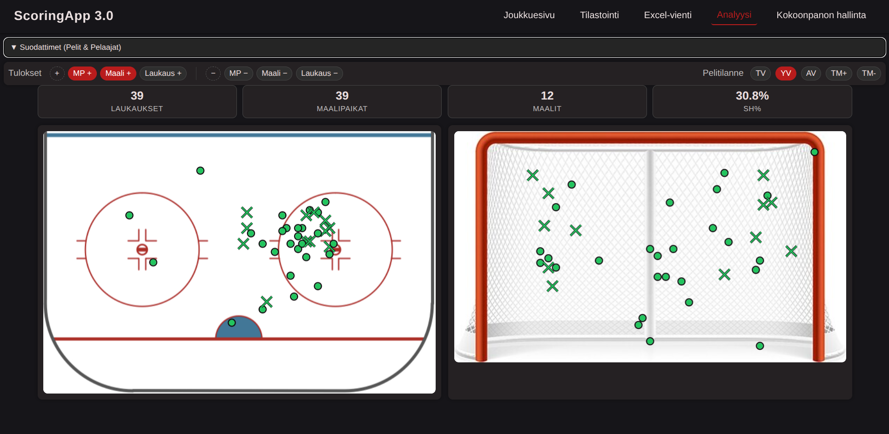
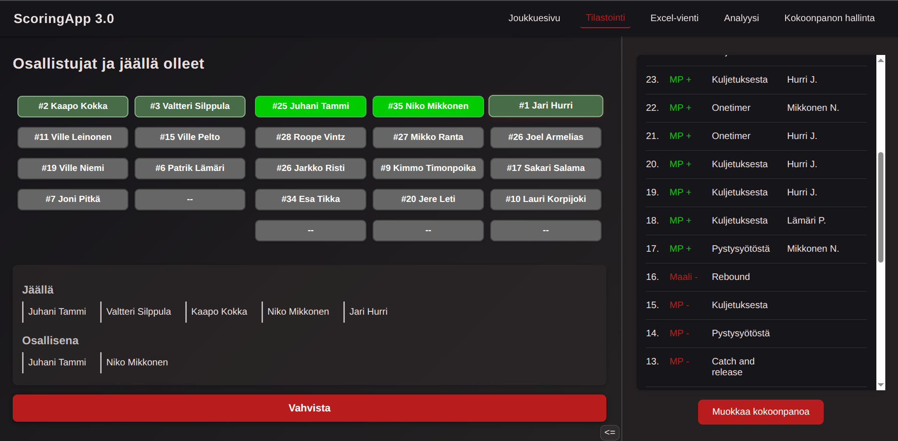
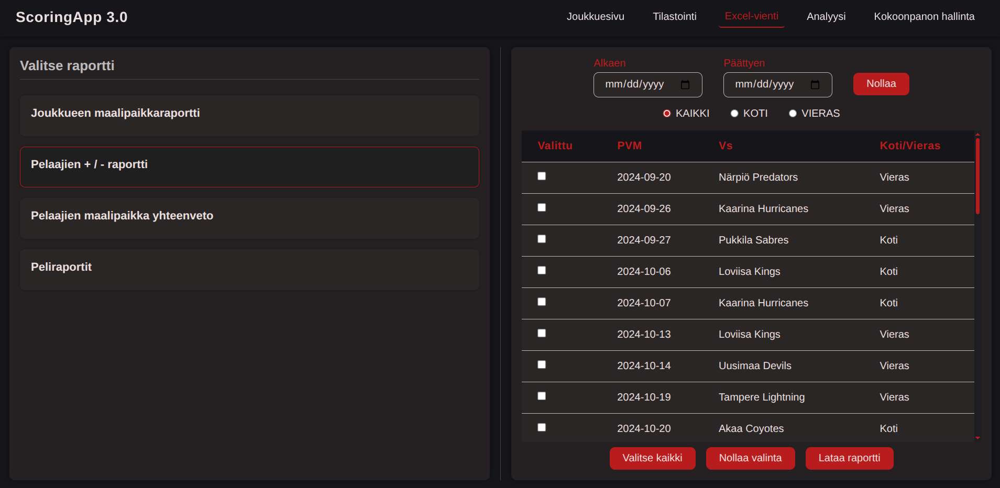

# 🏒 Hockey Coaching Stats App

A full-stack web application for tracking and analyzing ice hockey scoring chances and player performance. Built for real coaching staff to make data-driven decisions.

**🔴 Live & In Production** — Currently used by 3 Finnish U16–U18 SM-sarja teams

---

## 📋 Overview

This application helps hockey coaches track scoring chances (not just goals) to get a more complete picture of team and player performance. This tool can be used to uncover strengths and weaknesses beyond traditional statistics both at team and individual player levels.

### Key Features

- **Video-Based Game Tagging** — Review game footage and tag scoring chances efficiently and informatively
- **Excel Export** — Generate detailed reports for deeper analysis
- **Team Dashboard** — Season overview with filtering by game range
- **Zone Visualization** — Heat maps showing where shots and chances come from (ice zones) and where they go (net zones)
- **Player Analytics** — Individual player stats with plus/minus tracking for both goals and chances
- **Multi-user Support** — Multiple coaches can collaborate on the same team
- **Roster Scraper** — Automatically fetch game rosters from Finnish Ice-Hockey Federation website (Playwright)

---

## 🛠️ Tech Stack

### Frontend
- **React 19** with Vite
- **React Router** for navigation
- **Custom CSS** (no UI framework — intentional choice for learning)
- **Canvas API** for zone map visualizations
- **localStorage** caching for instant dashboard loads

### Backend
- **FastAPI** (Python)
- **SQLAlchemy 2.0** with typed models
- **Pydantic** for request/response validation
- **JWT Authentication** (python-jose + bcrypt)
- **Alembic** for database migrations
- **Playwright** for web scraping game rosters

### Infrastructure
- **Frontend**: Vercel
- **Backend**: Render (free tier with cold starts)
- **Database**: Neon (serverless PostgreSQL)

---

## 📊 Database Schema

The application uses a relational model with 12+ tables including:

- `users` / `teams` — Multi-tenant team management
- `players` / `games` — Roster and schedule tracking  
- `player_stats_tags` — Individual scoring chance events with ice position, net position, shot type, and result
- `team_stats_tags` — Team-level play pattern tracking (rushes, power plays, faceoffs, etc.)
- Junction tables for tracking which players were on-ice or participating in each event

---

## 🎯 What This Project Demonstrates

| Skill | Implementation |
|-------|----------------|
| **Full-stack development** | React frontend + FastAPI backend + PostgreSQL |
| **API design** | RESTful endpoints with Pydantic validation |
| **Database modeling** | Complex relational schema with SQLAlchemy ORM |
| **Authentication** | JWT-based auth with role management |
| **Data visualization** | Custom Canvas-based heat maps |
| **Real-world problem solving** | Built for actual users with real requirements |
| **Production deployment** | Multi-service cloud architecture |
| **Iterative development** | 3rd major version after learning from previous attempts |

---

## 📈 Project History

This project started to solve a personal need. I work as a coach for a hockey team, and wanted better tools to analyze our games. The first two versions were built just for our team.

| Version | Year | Stack | Lessons Learned |
|---------|------|-------|-----------------|
| 1.0 | 2023 | Python + Tkinter | Started with nearly zero experience, ended up with a working but completely unmaintainable desktop app |
| 2.0 | 2024 | Python + PyQt | Lessons learned and applied about maintainability. Destop app distribution was a huge challenge and every update was a gamble |
| 3.0 | 2025 | React + FastAPI | Web-based = accessible anywhere, easy updates. Has so far offered great full-stack development experience |

The decision to rebuild as a web app solved the core usability issues and opened the door to multi-user collaboration. Now 3 teams use it.

---

## 🚀 Future Plans

- Productize as a paid SaaS for hockey teams
- Add goalie-specific statistics tracking
- Mobile/Tablet-optimized tagging interface
- Build additional software for live tagging (timestamps) syncable with video footage

---

##  License

© 2023–2026 Joona Rahm. All rights reserved.

This is proprietary software. The source code is publicly visible for portfolio and demonstration purposes only. No permission is granted to use, copy, modify, distribute, or deploy this software or any portion of it without explicit written consent from the owner.

**Interested in getting access for your team?** Contact me for any inquiries regarding demos or licensing at joona-rahm@hotmail.com.

---

## 🖼️ Screenshots

### Team Dashboard
Season overview with KPIs, zone heat maps, and a games-range slider for filtering.

### Player Statistics
Sortable player stats table showing goals, chances, and plus/minus metrics.

### Analysis View
Filter by game situation (e.g., power-play) and visualize shot locations on the rink and net.

### Game Tagging — On-Ice Selection
Select which players were on the ice and who actively participated in a scoring chance. Previous tags for the game are listed on the left.

### Excel Reports
Export filtered data to Excel with multiple report types and date/location filters.

